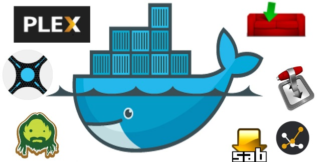

A collection of services that stands up all your media automation needs with Docker containers.

This example will be using a Qnap TS-251+ as a media harvesting machine!

I much prefer having the control over the persistent volume space for backups, as opposed to having to dig through the NAS internal volumes. Also it's what I am used to so easy to do. There is a bit of a learning curve with docker but once you understand how it all works it's straight forward and universal.

It's not ideal to run a torrent client without a VPN, so qTransmission is out. Containers allow you to only run the services you want anonymity for through a VPN (deluge-vpn), whilst also providing a proxy for tunneling other services through (privoxy).

Beyond radarr, sonarr and a download client:

*  [Tautulli](https://tautulli.com/) -  to monitor your Plex server
*  [Ombi](https://ombi.io/) - gives your Plex users the ability to request content
*  [Jackett](https://github.com/Jackett/) - is a single repository of maintained indexer scraping & translation logic
*  [Radarr]() - for automatically downloading movies via Usenet and BitTorrent.
*  [Sonarr](http://sonarr.tv) - can monitor multiple RSS feeds for new episodes of your favorite shows and will grab, sort and rename them.
*  [Organizr](https://organizr.app/) - to pull it all together and save your browser from tab overload

* SABnzb or NZBGet for Usenet downloading

QNAP Has created a Data share area under: /share/CACHEDEV1_DATA and we place everything under "media".
For Reference:

```
/share/CACHEDEV1_DATA/media/movies
/share/CACHEDEV1_DATA/media/tv
/share/CACHEDEV1_DATA/media/music
```
## 
*  [Tautulli](https://tautulli.com/) - Tautulli is the best application to monitor your Plex server.  [Docker Hub for Tautulli](https://hub.docker.com/r/linuxserver/tautulli/)

*  [Ombi](https://ombi.io/) - gives your shared Plex users the ability to request content by themselves! Ombi can be linked to multiple TV Show and Movie DVR tools to create a seamless end-to-end experience for your users.  [Docker Hub for Ombi](https://hub.docker.com/r/linuxserver/ombi/)

*  [Jackett](https://github.com/Jackett/) - Works as a proxy server: it translates queries from apps (Sonarr, Radarr, SickRage, CouchPotato, Mylar, DuckieTV, qBittorrent, Nefarious etc) into tracker-site-specific http queries, parses the html response, then sends results back to the requesting software. This allows for getting recent uploads (like RSS) and performing searches. Jackett is a single repository of maintained indexer scraping & translation logic - removing the burden from other apps.  [Docker Hub for Jackett](https://hub.docker.com/r/linuxserver/jackett/)

*  [Organizr](https://organizr.app/) - allows you to setup "Tabs" that will be loaded all in one webpage.  [Docker Hub for Organizr](https://hub.docker.com/r/linuxserver/organizr)

*  [Radarr]() - Radarr is an independent fork of Sonarr reworked for automatically downloading movies via Usenet and BitTorrent.  [Docker Hub for Radarr](https://hub.docker.com/r/linuxserver/radarr/)
 
*  [Sonarr](http://sonarr.tv) - Sonarr (formerly NZBdrone) is a PVR for usenet and bittorrent users. It can monitor multiple RSS feeds for new episodes of your favorite shows and will grab, sort and rename them. It can also be configured to automatically upgrade the quality of files already downloaded when a better quality format becomes available.  [Docker Hub for Sonarr](https://hub.docker.com/r/linuxserver/sonarr/)

### docker

```
docker create \
  --name=sonarr \
  -e PUID=1000 \
  -e PGID=1000 \
  -e TZ=Europe/London \
  -p 8989:8989 \
  -v <path to data>:/config \
  -v <path/to/tvseries>:/tv \
  -v <path/to/downloadclient-downloads>:/downloads \
  --restart unless-stopped \
  linuxserver/sonarr
```

### docker-compose

Compatible with docker-compose v2 schemas.

```
---
version: "2"
services:
  sonarr:
    image: linuxserver/sonarr
    container_name: sonarr
    environment:
      - PUID=1000
      - PGID=1000
      - TZ=Europe/London
    volumes:
      - <path to data>:/config
      - <path/to/tvseries>:/tv
      - <path/to/downloadclient-downloads>:/downloads
    ports:
      - 8989:8989
    restart: unless-stopped
```

## Parameters

Container images are configured using parameters passed at runtime (such as those above). These parameters are separated by a colon and indicate `<external>:<internal>` respectively. For example, `-p 8080:80` would expose port `80` from inside the container to be accessible from the host's IP on port `8080` outside the container.

| Parameter | Function |
| :----: | --- |
| `-p 8989` | The port for the Sonarr webinterface |
| `-e PUID=1000` | for UserID - see below for explanation |
| `-e PGID=1000` | for GroupID - see below for explanation |
| `-e TZ=Europe/London` | Specify a timezone to use EG Europe/London, this is required for Sonarr |
| `-v /config` | Database and sonarr configs |
| `-v /tv` | Location of TV library on disk |
| `-v /downloads` | Location of download managers output directory |

## User / Group Identifiers

When using volumes (`-v` flags) permissions issues can arise between the host OS and the container, we avoid this issue by allowing you to specify the user `PUID` and group `PGID`.

Ensure any volume directories on the host are owned by the same user you specify and any permissions issues will vanish like magic.

* Radarr - to do all heavy listing finding releases, sending to downloader then renaming and moving files when download completes
In Summary - You need sonarr and radarr. They do all the heavy lifting of finding releases, sending to downloader and then renaming and moving files when downloaded.

## What's in the box?!

*  [Radarr](https://radarr.video/) (tv search & download manager)
*  [CouchPotato](https://couchpota.to) (movie search & download manager)
*  [Transmission](https://transmissionbt.com) (torrent download manager)
*  [Tautulli](https://tautulli.com/) (Plex analytics and monitoring Plex)
*  [Plex Media Server (plexpass)](https://plex.tv) (tv & movie organizer and sharing)

#### ALTERNATIVES
*  [Sabnzbd](http://sabnzbd.org) (usenet download manager)
*  [Sickbeard](http://sickbeard.com) (tv search & download manager)
## Getting Started

### Prequisites
* You're on a *nix machine (preferably Ubuntu)
  * [Install Docker following these steps](https://docs.docker.com/linux/step_one/)
  * Make sure docker-compose is installed via:
    * `apt-get install docker-compose`
* For the purposes of this guide...
  * All of your media is located at `./media`
  * Your temp directory is located at `./temp`
* This guide assumes you have a hosts file mapping `ultimate.media.server` to `127.0.0.1`.

### To setup (NPM is Node Package Manager for Node.js)
* `npm install`

### To start
* `PIA_USER=username PIA_PASS=password npm run docker`
  * Note that this will take a few minutes depending on your broadband speed on inital startup.
  * Every restart thereafter will be almost instant.
* Bonus: All containers will automatically restart after power outages

### To stop
* `npm run docker:stop`

### To restart (useful for quick auto-updating of apps)
* `npm run docker:restart`

Once the install finishes open your navigate to the following:

*  [http://ultimate.media.server:8080](http://ultimate.media.server:8080) // Sabnzbd
*  [http://ultimate.media.server:8081](http://ultimate.media.server:8081) // Sickbeard
*  [http://ultimate.media.server:8989](http://ultimate.media.server:8989) // Radarr
*  [http://ultimate.media.server:5050](http://ultimate.media.server:5050) // CouchPotato
*  [http://ultimate.media.server:5051](http://ultimate.media.server:5051) // CouchPotato (for prereleases)
*  [http://ultimate.media.server:8091](http://ultimate.media.server:8091) // Transmission
*  [http://ultimate.media.server:8181](http://ultimate.media.server:8181) // Tautulli
*  [http://ultimate.media.server:32400/web](http://ultimate.media.server:32400/web) // Plex Media Server

### Want Transmission to run with authentication?
* Add the transmission username and password params and run the command below.
* `PIA_USER=username PIA_PASS=password TRANSMISSION_USER=tUsername TRANSMISSION_PASS=tPassword npm run docker`

### The &lt;insert service&gt; web app won't come up or isn't running

* This guide is only supported on *nix OSes. Try running on Ubuntu.
* Try restarting the services with `npm run docker:restart`

Special thanks to the maintainers of the following docker containers:
* [linuxserver/plex](https://hub.docker.com/r/linuxserver/plex)
* [linuxserver/tautulli](https://hub.docker.com/r/linuxserver/tautulli)
* [linuxserver/radarr](https://hub.docker.com/r/linuxserver/radarr)
* [linuxserver/sabnzbd](https://hub.docker.com/r/linuxserver/sabnzbd)
* [linuxserver/couchpotato](https://hub.docker.com/r/linuxserver/couchpotato)
* [timhaak/sickbeard](https://hub.docker.com/r/timhaak/sickbeard)
* [haugene/transmission-openvpn](https://hub.docker.com/r/haugene/transmission-openvpn)
* [nginx](https://hub.docker.com/_/nginx)
